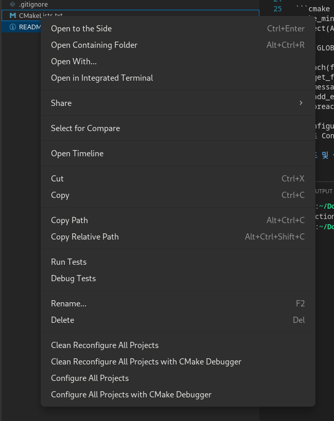
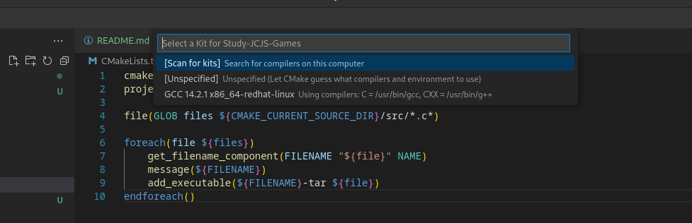
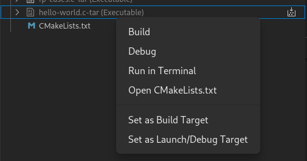

# 준비물
- gcc
- make
- cmake
- vs code


# 준비물 본인점검 사항
터미널을 열어 아래 명령어들을 순차적으로 실행하여 버전이 정상적으로 출력되는지 확인하십시오

```sh
gcc --version
make --version
cmake --version
```

# VS Code 프로젝트 준비 점검사항
- 빈 폴더 하나 만드시고
- 그 디렉토리에 Visual Studio Code를 여십시오
- CMakeLIsts.txt를 루트 디렉토리에 만드십시오.

# CMakeLists Project 준비사항
- CMakeLists.txt에 다음과 같이 작성하십시오.

    ```cmake
    cmake_minimum_required(VERSION 3.10)
    project(A)

    file(GLOB files ${CMAKE_CURRENT_SOURCE_DIR}/src/*.c*)

    foreach(file ${files})
        get_filename_component(FILENAME "${file}" NAME)
        message(${FILENAME})
        add_executable(${FILENAME}-tar ${file})
    endforeach()
    ```
- Configure하십시오.  
- 다음과 같은 화면에서 Configure를 확인할 수 있습니다.  
- Configure All Projects를 선택하십시오.
    > 

- 최초 Configure(구성) 단계에서 키트를 선택해야 할 것입니다. GCC를 남자답게 설정하십시오
    > 

# 빌드 및 실행하기

구성
- CMake 아이콘을 누르십시오. 일루미나티가 몽키스패너 들고 있는 거처럼 생겼습니다.
    > 
-  좌측 상단 PROJECT STATUS에 마우스를 호버링하면 오른쪽에 네 개의 작은 아이콘이 생깁니다.
- 두 번쨰 아이콘은 전체 프로젝트 구성이라 부르겠습니다.
- 전체 프로젝트 구성을 누르십시오.

빌드
- 구성에 성공하셨을 경우 좌측 하단에 PROJECT ONLINE이 보일 것입니다.
- A 아래에 hello-world.c-tar를 찾을 수 있을 것입니다.
- 우클릭 할 경우 터미널에서 실행하기 혹은 Run in Terminal이 있을 것입니다.
    > 
- 터미널에서 실행하기를 누르십시오.  
    > or run in terminal
- Hello World! 정상적으로 출력될 경우 성공하신 겁니다.